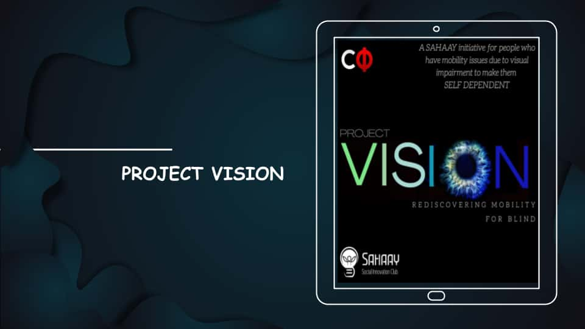
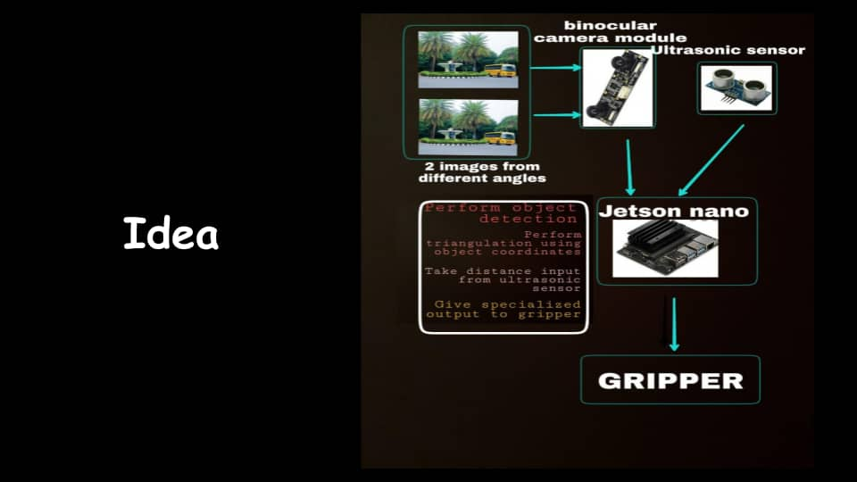
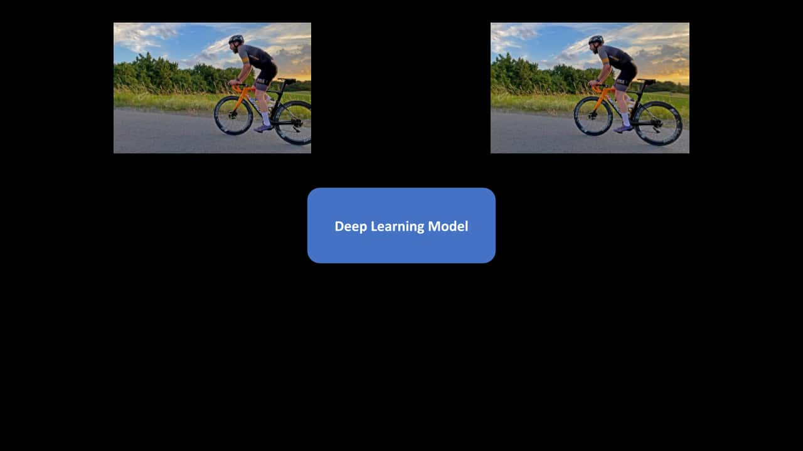
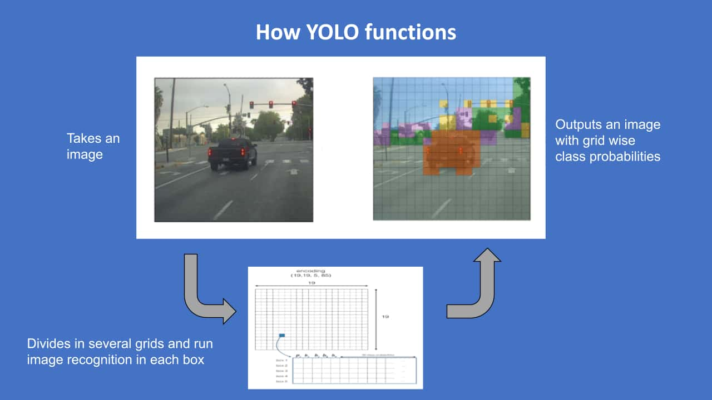
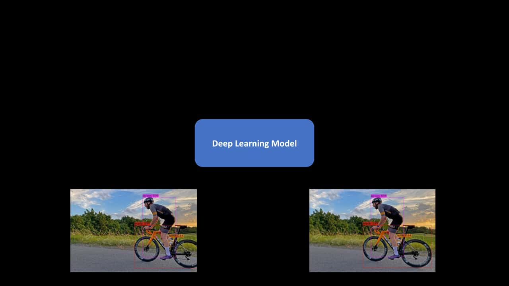
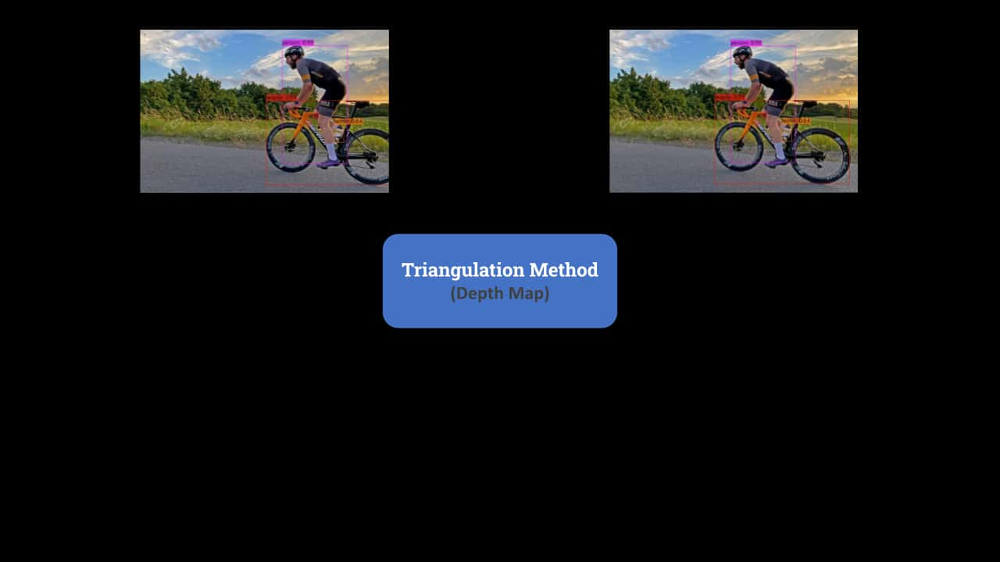
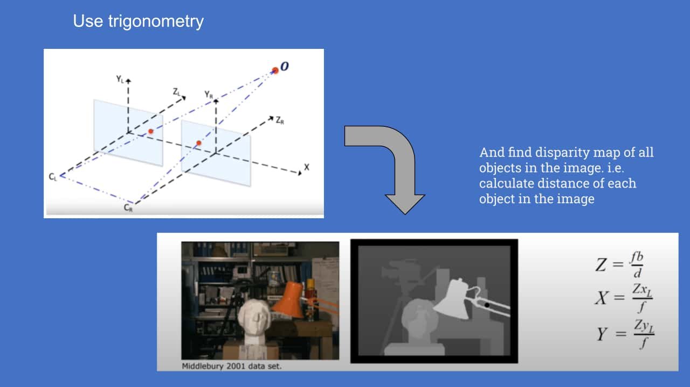
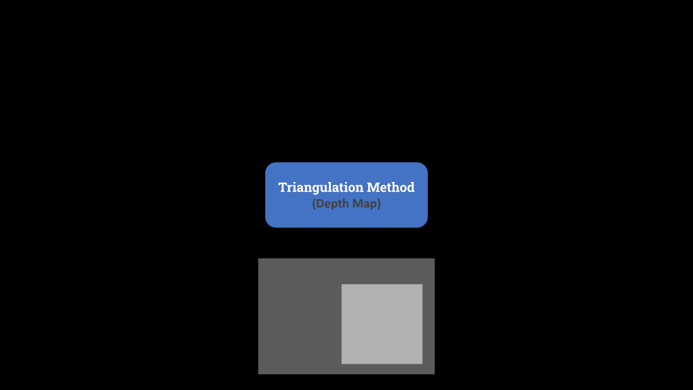
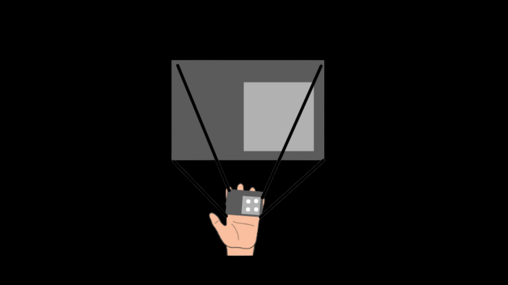

# [Project Vision: Rediscovering Mobility For Blind](https://youtu.be/acc7wHFKoWU) 


**View on Youtube : https://youtu.be/acc7wHFKoWU**

<a href="https://youtu.be/acc7wHFKoWU"></a>


# Aim:
To make an Electronic Travel Aid(ETA) for visually impaired.
# Why?
Independent mobility for a visually challenged person is a day-to-day problem. It is difficult for them to determine a safe path without colliding with over-hanging and protruding objects. **Project VISION** is an attempt to solve this very problem using **computer vision and deep learning technology**.<br>

# How?
 The idea is to develop an **Electronic Travel Aid(ETA)** that will act like artificial eyes for the blind and convey information regarding any obstacle on the user's **fingertip**. <br>
The ultimate goal is to make the life of the visually impaired easier by assisting them to move around and cope with the busy world.

<a href="https://youtu.be/acc7wHFKoWU"></a>

## 1. Object Detection from Live Camera Feed
<a href="https://techhd.herokuapp.com/"></a><br>
<a href="https://techhd.herokuapp.com/"></a><br>
<a href="https://techhd.herokuapp.com/"></a>


## 2. Depth Map Generation from stereo images
<a href="https://techhd.herokuapp.com/"></a><br>
<a href="https://techhd.herokuapp.com/"></a><br>
<a href="https://techhd.herokuapp.com/"></a>

## 3. Feeding the information to the user via Jetson Nano
<a href="https://techhd.herokuapp.com/"></a>


# Object Detection Using A Pre-Trained Model
1. **Darknet Setup on Jetson Nano**
    - Clone this repository into local system and change the directory.
      ```sh
      git clone https://github.com/yogeshiitm/Project-Vision.git
      cd Project-Vision
      make
      ```
    - Download the pre-trained [weight](https://pjreddie.com/media/files/yolov3.weights)
      ```sh
      wget https://pjreddie.com/media/files/yolov3.weights
      ```
2. **Then run the object detector**
    - on a single image
      ```sh
      ./Project-Vision detect cfg/yolov3.cfg yolov3.weights data/dog.jpg
      ```
      Darknet prints out the objects it detected, its confidence, and how long it took to find them.
      We didn't compile Darknet with OpenCV so it can't display the detections directly. Instead, it saves them in predictions.png.
      
    - on multiple image
      ```sh
      ./Project-Vision detect cfg/yolov3.cfg yolov3.weights
      ```
      Instead of supplying an image on the command line, we can leave it blank. Now we will be asked to enter an image path, so enter data/horses.jpg to have it predict boxes for that image. Once it is done it will prompt for more paths to try different images.
 
2. **Changing The Detection Threshold**
    - By default, YOLO only displays objects detected with a confidence of .25 or higher. You can change this by passing the -thresh <val> flag to the yolo command. For example, to display all detection you can set the threshold to 0
      ```sh
      ./Project-Vision detect cfg/yolov3.cfg yolov3.weights data/dog.jpg -thresh 0
      ```

3. **Real-Time Detection on a Webcam**
    -  To run detection on the input from a webcam, we will need to compile Darknet with [CUDA and OpenCV](https://pjreddie.com/darknet/install/#cuda). Then run the command:
       ```sh
       ./Project-Vision detector demo cfg/coco.data cfg/yolov3.cfg yolov3.weights
       ```
       YOLO will display the current FPS and predicted classes as well as the image with bounding boxes drawn on top of it.

 
# Important Links
**Yolo Code Credit: https://github.com/pjreddie/darknet** <br>
**View the glimpse of our project on Youtube : https://youtu.be/acc7wHFKoWU**

# Team Members
Team Sahaay(Social Innovation Club), Center For Innovation, IIT Madras
1. **Vinayak Nishant Gudipaty**, 2nd year Electrical, IIT Madras
2. **Yogesh Agarwala**, 2nd year Electrical, IIT Madras
3. **Harshit Raj**, 2nd year Mechanical, IIT Madras
4. **Saroopa G**, 2nd year Mechanical, IIT Madras
5. **Anish Pophale**, 1st year Chemical, IIT Madras
